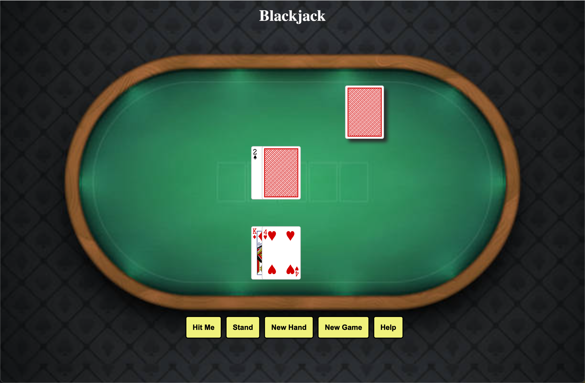
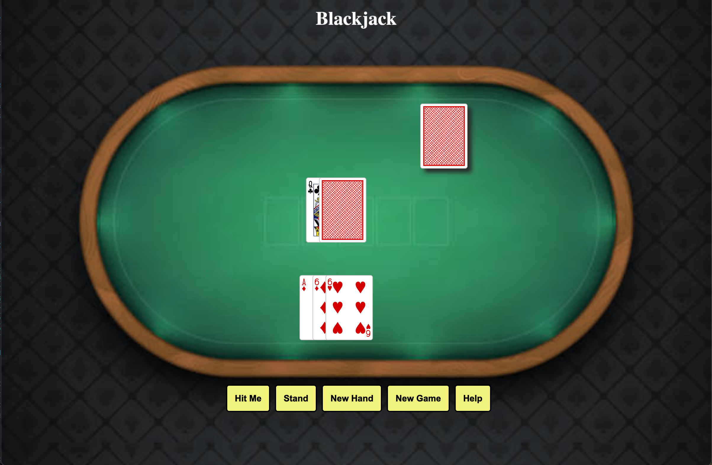
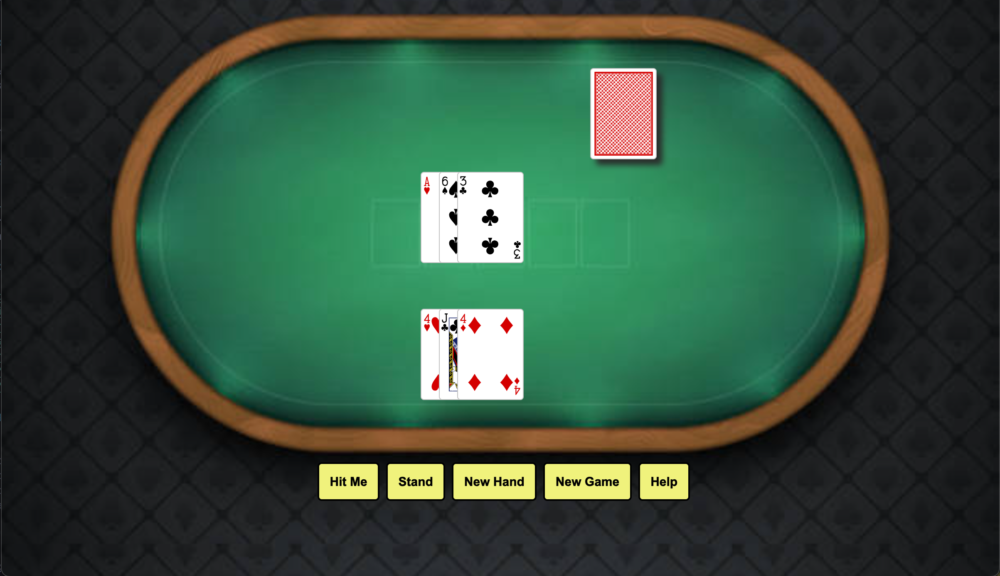
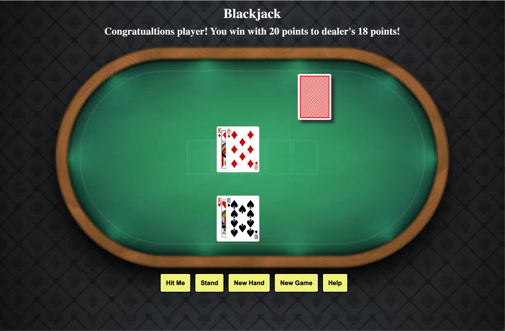
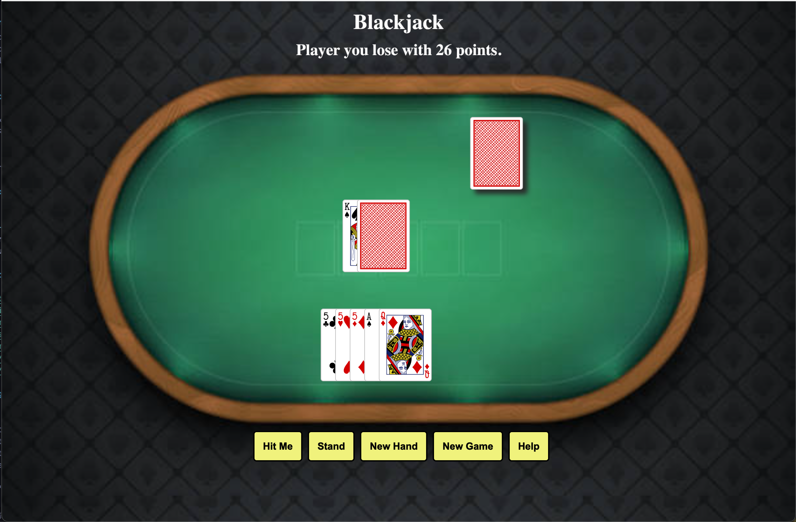

# Blackjack

### [Click to Play](https://tehilahzaman.github.io/project-card-game-blackjack/)

##### Created By Tehilah Zamanzadeh

## :spades: Description

Blackjack is a card game, in this interation, played between two players: the dealer and the user (AKA the player). The goal is to get the value of your cards (AKA hand) to 21 or be the closest to 21. Players can interact with the page, deciding when to have a new card dealt with the 'Hit Me' button and when to end their turn with the 'Stand' button. 'Hit Me' will deal new cards from the deck and reset the points, and 'New Game' will refresh the deck and restart the game. The 'Help' button will prompt an pop-up which will provide an explanation of how to play. Players can play for as long as they like and enjoy a relaxing game of BlackJack.

## :clubs: How to Play

The goal of BlackJack is to get the sum of your hand to 21, or closer to 21 than your opponant. The player and dealer begin with two cards each. Royals are 10 points and aces can be 11 or 1 point. The player pushes 'Hit Me' when they want another card delt into their hand, if player gets 21 they win, over 21 is a bust. When the player is satisfied with their hand, they hit 'Stand' and the dealer's turn begins. If the dealer's hand reaches 21 the dealer wins, if over 21 it's a bust for the dealer and the player wins. If no one reaches 21, the player closest to 21 wins.

## :camera_flash: Screenshots

|     Screenshot      |                                                        Description                                                         |
| :-----------------: | :------------------------------------------------------------------------------------------------------------------------: |
|   **Game Start**    |                                                              |
|  **Player's Turn**  |                                                        |
| **Computer's Turn** |                                                        |
| **Render Win/Loss** |   |

## :computer: Technologies Used

## :fire: Getting Started

 Instructions 

    1. Click 'Hit Me' to add another card to your hand 
    2. Repeat until satisfied with hte sum of your cards
    3. Click 'Stand' to end your turn
    4. After the dealer's turn and the winner is determined, click 'New Hand" new deal new cards from the deck
    5. 'New Game' will restart the game and refresh the cards and deck 

  
 Deployed Link 

  <a href="https://tehilahzaman.github.io/project-card-game-blackjack/"
    > https://tehilahzaman.github.io/project-card-game-blackjack/ </a
  >

## :satellite: Upcoming Features

- [x] README.md

- [ ] Add animations when card is dealt from the deck

- [ ] Add sound when card button is clicked
